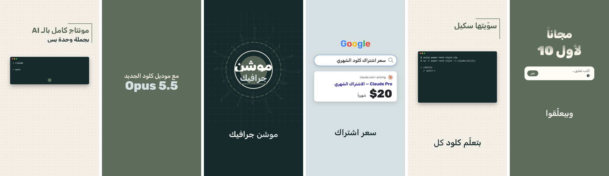

# reel-styles 🎬

**ستايلات مونتاج ريلز بالعربي لـ Claude Code.** بتعطيه فيديو بتحكي فيه للكاميرا وبتقله «منتجه»، وهو بيطلّع ريل جاهز 9:16: كابشن عربي متزامن مع كلامك، وموشن بيتحرك على كلماتك، وانتقالات بأصواتها، وصوت معاير لإنستغرام. بهويتك البصرية إنت.



## شو فيه

سكيلين (ستايلين) مستقلين، ما بتحتاج أي سكيل تاني:

| السكيل | الشكل | بتقوله |
|---|---|---|
| **`split-reel-style`** | سبليت تقني: الرسمة أو المثال الحي فوق، ووجهك تحت بكرت مدوّر وراسك طالع منه. لقطات رسم كاملة ولقطات وجه | «منتجه بستايل السبليت» |
| **`paper-reel-style`** | ورق مربعات تعليمي: عناوين بلونين، مدارات، شرائح ملوّنة، كرت وجه بشعارات أدوات، لقطات شاشة مايلة 3D | «منتجه بستايل الورق» |

**اللي بيعمله لك:**
- 🎙️ تفريغ كلامك بتوقيت كل كلمة (whisper)، وبيكشف المقاطع اللي بتنسقط وبيرجّعها
- 💬 كابشن عربي بخط Rubik، بدفعات بتمشي مع الكلام، مع كشيدة وتمييز ومستطيل معكوس
- 🎬 **موشن دلالي**: لما تقول «بحثت على جوجل» بيطلع شريط بحث وكلماتك بتنكتب فيه، «سألت كلود» بيطلع شات، «السعر 20 دولار» الرقم بيعدّ لحد ما تلفظه، وبآخر الفيديو كرت فولو بصورتك
- ⚡ 8 انتقالات (فلاش كاميرا، كرت، سحبة، زوم، خلل، بقعة سائلة، تسريب ضوء، قطع)، **كل واحد بصوته**
- 🧑‍💻 قص الشخص ليطلع راسك فوق الخلفية الملوّنة (للتقسيمة)
- 🎵 مؤثرات صوتية وموسيقى مولّدة بالكود (بدون حقوق)، واختيارك: بدون موسيقى، أو مولّدة، أو ملفك
- 🔊 معايرة -14 LUFS بمحدّد يمنع التشويه، ونسختين (بموسيقى وبدون) وترجمة `.srt`

## المتطلبات
- [Claude Code](https://claude.com/claude-code) (سطح المكتب أو الطرفية)
- **Python 3.9+** · **Node.js 18+** · **ffmpeg** · **Chrome أو Edge**
- مكتبات بايثون: `openai-whisper` `rembg` `onnxruntime` `numpy` `scipy` `pillow` (بيثبّتهم الأمر تحت)
- موديلات بتنزل أول استخدام، مرة وحدة: whisper `medium` (1.4GB، الأدق بالعامية) أو `small` (460MB) · قص الشخص (170MB)
- ويندوز، ماك، لينكس

## التثبيت

**ويندوز (PowerShell):**
```powershell
irm https://raw.githubusercontent.com/Karam-Eyad/reel-styles/main/install.ps1 -OutFile install.ps1
powershell -ExecutionPolicy Bypass -File .\install.ps1 -Install
```

**ماك / لينكس:**
```bash
curl -fsSL https://raw.githubusercontent.com/Karam-Eyad/reel-styles/main/install.sh | bash -s -- -i
```

`-Install` / `-i` بيثبّت المكتبات الناقصة كمان (بدونه بيفحص وبيقلّك شو ناقص). بعدها السكيلين بيصيروا بـ `~/.claude/skills/` وجاهزين.

**يدوي:** نزّل الـ zip من [Releases](../../releases) ← فكّه ← انسخ مجلدي `split-reel-style` و`paper-reel-style` لـ `~/.claude/skills/` ← شغّل `python ~/.claude/skills/split-reel-style/scripts/setup_check.py --install`.

## الاستخدام

افتح Claude Code وقله مثلاً:

> منتجلي هالفيديو بستايل السبليت: `C:\Videos\my-reel.mov`

> منتج هالريل بستايل الورق، قصيت السكتات من قبل

**أول مرة** بيسألك عن هويتك البصرية (مرة وحدة بس): ألوانك، وصورة بروفايلك الأصلية، واسمك ويوزرك. وبيحفظها ما بتنمسح مع التحديثات.

**بعدها كل مرة:**
1. بيفرّغ كلامك وبيعرض عليك السكريبت مرقّماً. بتقله شو تشيل، وبيصحّح أغلاط whisper معك
2. **بيبعتلك جدول لقطات** فيه كل لقطة شو رسمتها وشو بدو منك (لقطة شاشة، رابط، شعار)، وشو بيجيبه لحاله، وبيسألك عن ملحقات تانية بدك تضيفها
3. بيعرض عليك معاينة بـ6 لقطات قبل الرسم الكامل
4. بيسألك عن الصوت: **موسيقى؟** بدون / مولّدة / من مكتبة مجانية / ترند بتضيفه من التطبيق / ملفك
5. بيرسم ويصدّر `final-nomusic.mp4` و`final-music.mp4` مع الترجمة

وبتقدر تشغّل كل خطوة لحالها من الطرفية (شوف `split-reel-style/SKILL.md`).

## الهوية البصرية
محفوظة بـ `~/.claude/split-reel-brand/brand.json` + صورتك بجنبه. القالب بـ [`split-reel-style/references/brand.example.json`](split-reel-style/references/brand.example.json): لوحة ألوان، وأسماء الخلفيات، ولون التمييز، وستايل كابشن الوجه، وبروفايلك (الاسم، التعريف، اليوزر). **صورتك بتنستخدم كما هي بدون أي قص أو تعديل**، وما بنعرض عدد المتابعين.

## الإصدارات

كل إصدار محفوظ، وبتقدر تختار أي إصدار (جديد أو قديم):

```powershell
.\install.ps1 -List                  # كل الإصدارات
.\install.ps1 -Version v1.0.0        # إصدار معيّن
.\install.ps1                        # آخر إصدار
```
```bash
./install.sh -l                      # كل الإصدارات
./install.sh -v v1.0.0               # إصدار معيّن
```

أو من صفحة [Releases](../../releases): نزّل zip الإصدار اللي بدك ياه. الإصدارات بتتبع [Semantic Versioning](https://semver.org/lang/ar/): `1.2.3` ← تحديث كبير يغيّر طريقة الاستخدام . تحديث بميزات جديدة . إصلاحات. التفاصيل بـ [`CHANGELOG.md`](CHANGELOG.md).

**التحديث:** شغّل نفس أمر التثبيت من جديد. **القديم بيتحفظ** بـ `~/.claude/skills/_backup/` (مع رقم إصداره)، ومكتبات `node_modules` بتضل. **الرجوع لإصدار قديم:** `-Version v1.0.0`، أو انسخ المجلد من `_backup`.

## مشاكل شائعة

| المشكلة | الحل |
|---|---|
| `ffmpeg مو موجود` | ثبّته: `winget install ffmpeg` (ويندوز) · `brew install ffmpeg` (ماك) |
| `ما لقيت Chrome` | ثبّت Chrome أو Edge، أو حدّد `CHROME_PATH` |
| whisper عم ينزّل ملف ضخم وما بخلص | موديل `medium` حجمه 1.4GB. على نت بطيء استخدم `--model small` (460MB)، أو نزّله على نت أسرع. وإذا الملف خربان امسحه من `~/.cache/whisper` |
| الكلمات الإنجليزية بتنقلب بمكان غلط بالكابشن | افصل العربي عن الإنجليزي بمسافة: «بالـ AI» مش «بالـAI» |
| ظل رمادي حوالين راسك بلقطات التقسيمة | بيطلع لما يكون بجنبك أغراض فاتحة. خلّي اللقطة على خلفية غامقة، أو استخدم `person_matte.py --erode 3` |
| ويندوز: الأحرف العربية `????` بالطرفية | شغّل `chcp 65001` أو استخدم Windows Terminal |
| الصوت مشوّه | `export.py` بيفحص الذروة ويحدّها لحاله. لو بتصدّر بغيره، خلّيها تحت ‎-1.5 dB |

## هيكل الريبو

```
split-reel-style/        السكيل الأساسي + المحرّك
  SKILL.md               التعليمات اللي بيقراها Claude
  engine/                محرّك رسم الفريمات (render.js) + خط Rubik محلي
  scripts/               تجهيز · تفريغ · كابشن · قص الشخص · صوت · موسيقى · تصدير
  kit/split-style.js     التقسيمة، الكابشن، الانتقالات، الموشن الدلالي
paper-reel-style/        ستايل الورق (بيعتمد على المحرّك أعلاه)
examples/                أمثلة تصميم حقيقية (shots.js)
install.ps1 · install.sh  التثبيت واختيار الإصدار
tools/release.ps1        نشر إصدار جديد
```

**إضافة ستايل جديد:** اكتب `kit/<name>-style.js` بتسجّل فيه أنواع لقطات (`SK.KINDS`) وانتقالات (`SK.TRANS`) ورسومات، وسكيل جديد بـ`SKILL.md` بيعتمد على نفس المحرّك. شوف `paper-reel-style` كمثال.

**نشر إصدار:** اكتب قسم الإصدار بـ`CHANGELOG.md` ثم `.\tools\release.ps1 -Version 1.1.0`.

## الترخيص
[MIT](LICENSE). الخط Rubik بترخيص [OFL](split-reel-style/engine/fonts/OFL.txt). شوف [THIRD_PARTY.md](THIRD_PARTY.md) للأدوات اللي بيستخدمها.

صُنع بواسطة [@karameyad._](https://instagram.com/karameyad._)
